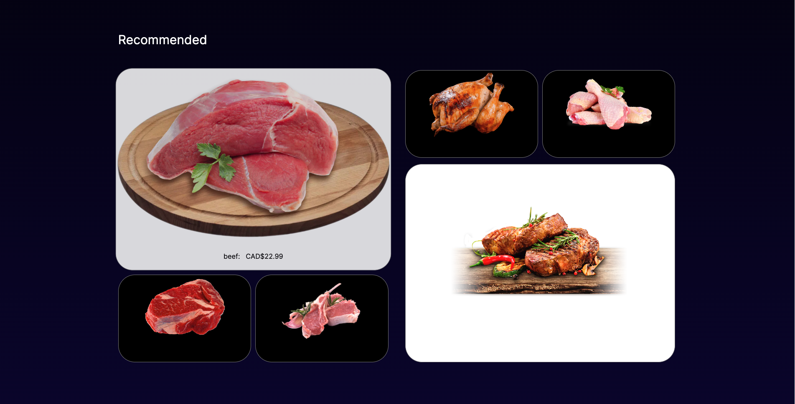
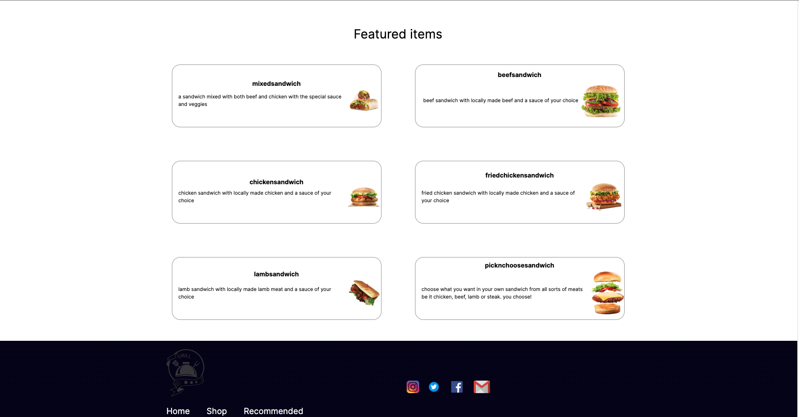
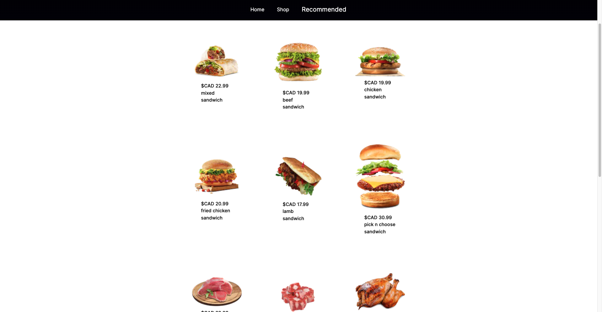
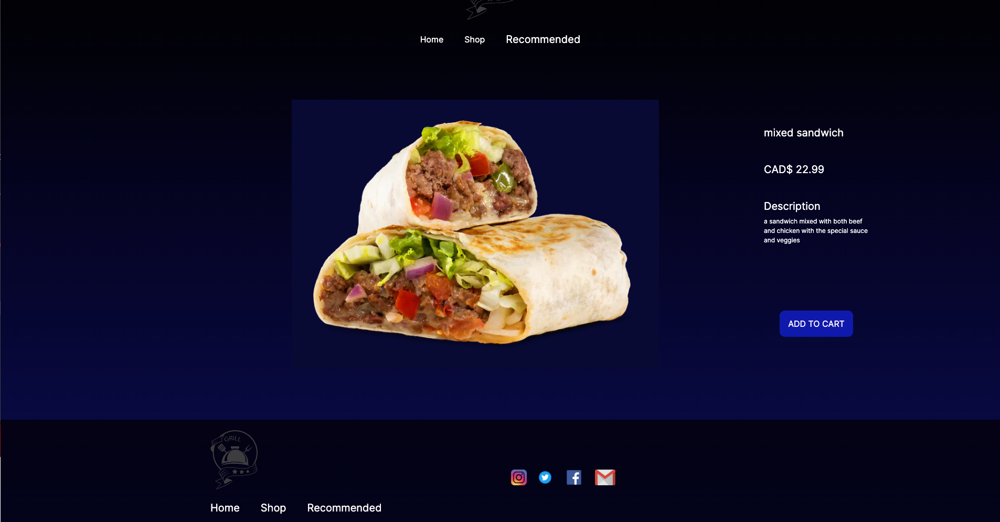

A fullstack restaurant website where the user can browse and purchase items from the shop and add them to their cart.

what has been used for this website:
- Next.js
- Tailwind
- Supabase
- fully customized API
- axios
- framer motion

Screenshots:

 
 
 
 
 
